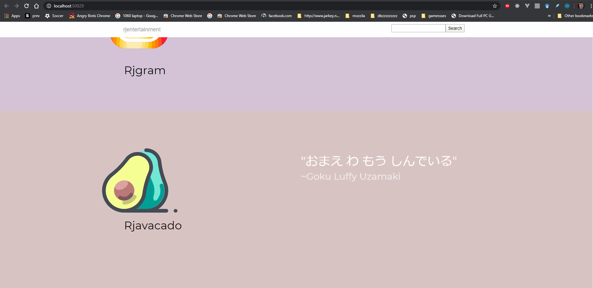

# rj Meme LORD
The goal of this product is to pull memes from my computer and load it to people in the best way possible

<h2>Technologies</h2>
.NET EF 4.5, MSSQL, isotope, jquery, 
<h2>Live Demo </h2>
goto: https://www.youtube.com/watch?v=aHvqi0t7nbI

<h2>Deployment </h2>
<strong>Tools Needed: Visual Studio 2017</strong>
 
 
 <strong>Awesome design webpage</strong>
  
  

<strong>Awesome meme filtering</strong>
  
  

<strong>Enjoy :)</strong> 
